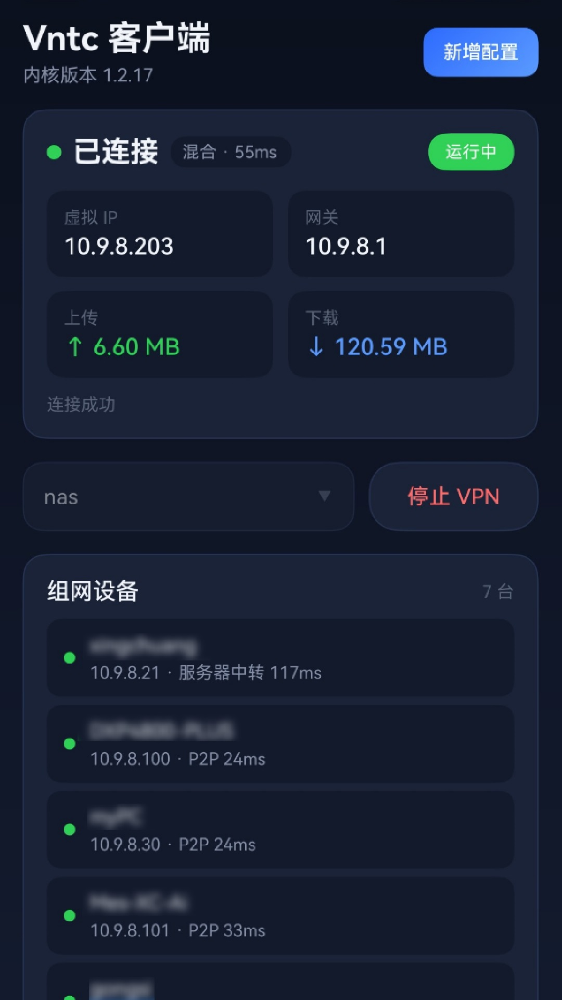

# Vntc

Vntc 是运行于 **HarmonyOS（纯血鸿蒙）** 平台的 VNT 组网客户端，通过 [VNT](https://github.com/lblbc/vnt) 隧道内核连接自建服务端，将分布在不同网络的设备组成一个虚拟局域网，支持 NAT 穿透（P2P）与服务器中转，实现设备间的安全直连。

- 应用包名：`top.16c.vntc`
- 设备形态：手机（phone）
- 语言/框架：ArkTS（ArkUI）+ C/C++（N-API）
- 目标 SDK：HarmonyOS API（`modelVersion 26.0.0`，`targetSdkVersion 26.0.0`，兼容 `6.1.1(24)`）

## 功能特性

- **多配置管理**：可新增/编辑/删除多套连接配置，切换使用。
- **VNT 组网连接**：基于隧道实现 NAT 穿透组网，支持 `仅中继 / 仅 P2P / 自动` 三种通道模式。
- **连接状态监控**：实时显示连接状态、虚拟 IP、网关、通道类型、延时与上下行流量。
- **设备列表**：展示组网内的在线设备及其在线状态、通道与延时。
- **灵活的传输参数**：支持选择加密算法（AES-GCM / ChaCha20 / AES-CBC / AES-ECB / XOR / 不加密）、压缩算法（LZ4）、自定义 STUN / DNS 服务器、服务端加密协商与数据包指纹校验等。
- **原生性能内核**：数据转发由 C/C++ 实现的 vnt 内核完成，通过 N-API 与 ArkTS 层桥接。

## 项目结构

```
Vntc
├── AppScope/                  # 应用级配置与资源（bundle、图标等）
├── entry/                     # 主入口模块
│   └── src/main/
│       ├── ets/
│       │   ├── entryability/  # EntryAbility（入口 UI 能力）
│       │   ├── pages/         # Index 主界面（ArkUI）
│       │   └── vpn/           # VntVpnAbility、配置存储与常量
│       ├── cpp/               # C/C++ N-API 桥接模块（libvnt_napi）
│       ├── libs/              # 预编译原生内核固件 libvnt_ffi.so（按 ABI 存放，不入库）
│       └── resources/         # 资源文件
├── hvigor/                    # 构建脚本
├── build-profile.json5        # 构建与签名配置
├── oh-package.json5           # 工程级依赖配置
└── .gitignore
```

## 环境要求

- [DevEco Studio](https://developer.huawei.com/consumer/cn/deveco-studio/)（HarmonyOS 应用开发 IDE）
- HarmonyOS SDK（需匹配工程 `modelVersion` / `targetSdkVersion` 所要求的 API 版本）
- 一台支持 HarmonyOS 的手机，用于真机调试与运行

## 原生内核固件（.so）

数据转发内核 `libvnt_ffi.so` 为**预编译二进制**，源码不在本仓库内，请从以下仓库获取与版本匹配的固件：

- 固件仓库：https://cnb.cool/16c.top/vntc-1.2.17

安装方法：将对应 ABI 的 `libvnt_ffi.so` 放到如下路径（工程已通过 `.gitignore` 排除该目录，不会被提交）：

```
entry/libs/<ABI>/libvnt_ffi.so
```

例如 `arm64-v8a` 架构：

```
entry/libs/arm64-v8a/libvnt_ffi.so
```

> 说明：`entry/src/main/cpp` 仅编译 N-API 桥接层 `libvnt_napi`，其在 `CMakeLists.txt` 中通过 IMPORTED 方式链接上面的 `libvnt_ffi.so`，缺少该文件将导致构建失败。

## 构建与运行

1. 使用 DevEco Studio 打开项目根目录。
2. 按上节安装好 `libvnt_ffi.so` 固件。
3. 等待 IDE 自动同步依赖（`oh_modules` 已被 gitignore，首次打开需触发同步/构建以下载）。
4. 连接已开启开发者模式的 HarmonyOS 设备。
5. 配置好本地签名后，执行 **Build → Build Hap(s)/APP(s)** 或直接运行到设备。

## 使用说明

1. 点击右上角「新增配置」，填写必要信息：
   - **配置名称**：便于识别的别名，如「家里服务器」。
   - **服务端**：格式 `udp://host:port`、`tcp://host:port` 或 `ws://host:port`。
   - **令牌 Token**：需与自建服务端保持一致。
   - **密码（可选）**：组网密码。
   - **设备 ID / 名称 / 虚拟 IP**：留空时设备 ID 自动生成、虚拟 IP 由服务端分配。
   - 高级项（加密/压缩算法、STUN/DNS、通道模式等）可按需调整。
2. 保存后在下拉框中选中该配置，点击「启动连接」。
3. 连接建立后可在状态卡片中查看虚拟 IP、网关、延时与流量，并查看组网内的设备列表。

## 目录与安全说明

- **签名配置**：`build-profile.json5` 中的签名（`material`、`storePassword`、`keyPassword` 等）为**机器本地的敏感信息**，不同机器路径与密钥均不同，请勿将含真实凭据的版本提交到仓库。
- 应用使用 `ohos.permission.INTERNET` 与系统 VPN 能力（`VpnExtensionAbility`），用于创建虚拟网卡与网络数据转发。

## 截图预览

主界面：



浏览 NAS 网页：


## License

[MIT](LICENSE)
